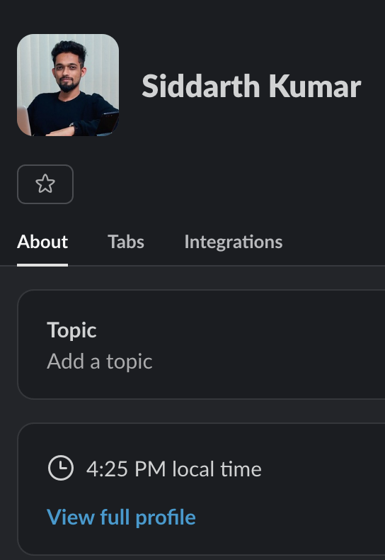

# Discord Time Rich Presence

A lightweight, Go app that publishes your current local time in your Discord Rich Presence status in real-time.
I built this because I liked this feature that slack has which shows your local time to anyone who clicks on your profile.
Discord lacked this due to their stance on _privacy_ lol.


## Screenshot

| Slack                           | Discord                         |
|---------------------------------|---------------------------------|
|  |  |

## What it does

This app creates a Discord Rich Presence that shows:
- **It's **: Your local time in HH:MM format (e.g., "It's 3:25 PM EST")
- **📅 Date**: Current date (e.g., "🗓️ Mon, Jun 23")
- **Live Updates**: Automatically refreshes every 30 seconds

Your Discord profile will display this as a "Playing" status that your friends can see!

## Features

- No external dependencies beyond standard library
- Communicates directly with Discord using the official RPC protocol
- Prompts for Discord Client ID if not provided
- Works on Windows, macOS, and Linux
- Single binary with no complicated build setup

## Instructions for Non Technical Users

## Just give me the binaries OR executable OR exe
- You can download the latest release from https://github.com/siddarthkay/discord-show-local-time/releases
- just unzip the binary that corresponds to your Environment
- Run the executable and it should connect to your Discord Desktop App

## Instructions for Technical Users

- **Discord Desktop App** (Rich Presence doesn't work with browser Discord)
- A **Discord Application ID** (free to create)

## Quick Start

### 1. Create a Discord Application

1. Go to [Discord Developer Portal](https://discord.com/developers/applications)
2. Click **"New Application"**
3. Give it a name (e.g., "My Time Display")
4. Copy the **Application ID** from the General Information page

> **Tip**: The Application ID is an 18-19 digit number like `1234567890123456789`

### 2. Enable Discord Rich Presence

In Discord Desktop App:
1. Go to **Settings** → **Activity Privacy**
2. Enable **"Display current activity as a status message"**

### 3. Run the Application

```bash
# Option 1: Set environment variable
export DISCORD_CLIENT_ID="your_application_id_here"
./discord-time-presence

# Option 2: Interactive prompt (app will ask for Client ID)
./discord-time-presence
```

## Example Output

```
Discord Time Rich Presence
=============================
Connecting to Discord using Client ID: 1234567890123456789
Connected to Discord!
Starting time updates (Ctrl+C to stop)...

Updated presence: 3:25 PM EST on Mon, Jun 23
Updated presence: 3:25 PM EST on Mon, Jun 23
Updated presence: 3:26 PM EST on Mon, Jun 23
```

Your Discord profile will then show:
- **Playing:** [Your App Name]
- **Details:** "It's 3:25 PM EST"
- **State:** "🗓️ Mon, Jun 23"


## Building from Source

### Prerequisites

```bash
# Check Go version
go version  # Should be 1.24+
```

# Clone the repository
git clone https://github.com/siddarthkay/discord-show-local-time.git
cd discord-show-local-time

### Build Commands
```bash
# Current platform
make build
```

## For Nix Users

If you're using Nix or NixOS, you can run this application without installing Go or other dependencies:

### Quick Run
```bash
# Run directly with nix (requires flakes)
nix run github:siddarthkay/discord-show-local-time

# Or clone and run locally
git clone https://github.com/siddarthkay/discord-show-local-time.git
cd discord-show-local-time
nix run
```

### Build with Nix
```bash
# Build the application
nix build

# The binary will be available at ./result/bin/discord-time-presence
./result/bin/discord-time-presence
```

### Development Environment
```bash
# Enter development shell with Go and make available
nix develop

# Then use standard make commands
make build
make run
```

> **Note**: Nix commands require experimental flakes feature. Enable with:
> ```bash
> nix --extra-experimental-features "nix-command flakes" <command>
> ```

## Configuration

### Setting Environment Variables
*Required unless provided via interactive prompt

**Linux/macOS:**
```bash
export DISCORD_CLIENT_ID="1234567890123456789"
./discord-time-presence
```

**Windows (Command Prompt):**
```cmd
set DISCORD_CLIENT_ID=1234567890123456789
discord-time-presence.exe
```

**Windows (PowerShell):**
```powershell
$env:DISCORD_CLIENT_ID="1234567890123456789"
.\discord-time-presence.exe
```

## Running as a Service

### Linux (systemd)

Create `/etc/systemd/system/discord-time-presence.service`:

```ini
[Unit]
Description=Discord Time Rich Presence
After=network.target

[Service]
Type=simple
User=your-username
WorkingDirectory=/path/to/discord-time-rich-presence
ExecStart=/path/to/discord-time-rich-presence/discord-time-presence
Restart=always
RestartSec=3
Environment=DISCORD_CLIENT_ID=your_client_id_here

[Install]
WantedBy=multi-user.target
```

Enable and start:
```bash
sudo systemctl daemon-reload
sudo systemctl enable discord-time-presence
sudo systemctl start discord-time-presence
sudo systemctl status discord-time-presence
```

### macOS (launchd)

Create `~/Library/LaunchAgents/com.yourname.discord-time-presence.plist`:

```xml
<?xml version="1.0" encoding="UTF-8"?>
<!DOCTYPE plist PUBLIC "-//Apple//DTD PLIST 1.0//EN" "http://www.apple.com/DTDs/PropertyList-1.0.dtd">
<plist version="1.0">
<dict>
    <key>Label</key>
    <string>com.yourname.discord-time-presence</string>
    <key>ProgramArguments</key>
    <array>
        <string>/path/to/discord-time-presence</string>
    </array>
    <key>RunAtLoad</key>
    <true/>
    <key>KeepAlive</key>
    <true/>
    <key>EnvironmentVariables</key>
    <dict>
        <key>DISCORD_CLIENT_ID</key>
        <string>your_client_id_here</string>
    </dict>
</dict>
</plist>
```

Load the service:
```bash
launchctl load ~/Library/LaunchAgents/com.yourname.discord-time-presence.plist
```

### Windows (Task Scheduler)

1. Open **Task Scheduler**
2. Click **Create Basic Task**
3. Name: "Discord Time Presence"
4. Trigger: **When I log on**
5. Action: **Start a program**
6. Program: Path to your `discord-time-presence.exe`
7. Add arguments: (none needed if using environment variables)
8. **Finish**

## Troubleshooting

### Connection Issues

**"Failed to connect to Discord"**
- [ ]  Ensure Discord Desktop app is running (not browser)
- [ ] Check that Rich Presence is enabled in Discord Settings → Activity Privacy
- [ ] Try restarting Discord completely
- [ ] Verify your Client ID is correct (18-19 digits)

**"DISCORD_CLIENT_ID environment variable required"**
- [ ] Set the environment variable or let the app prompt you
- [ ] Make sure there are no extra spaces in your Client ID

### Rich Presence Not Showing

**Rich Presence not visible:**
- [ ] Enable "Display current activity as a status message" in Discord
- [ ] Make sure you're using Discord Desktop (not web)
- [ ] Check that another Rich Presence app isn't conflicting
- [ ] Try running Discord as administrator (Windows)

### Build Issues

**"go: command not found"**
- [ ] Install Go from [golang.org](https://golang.org/dl/)
- [ ] Add Go to your PATH

### Platform-Specific Issues

**macOS: "cannot be opened because the developer cannot be verified"**
```bash
# Allow the app to run
sudo spctl --add discord-time-presence
# Or run with:
sudo xattr -d com.apple.quarantine discord-time-presence
```

**Linux: Permission denied**
```bash
chmod +x discord-time-presence
```

## License

This project is licensed under the MIT License - see the [LICENSE](LICENSE) file for details.

## Show Your Support

If this project helped you, please give it a [star](https://github.com/siddarthkay/discord-show-local-time/star)! ⭐

## Support

- **Issues**: [GitHub Issues](https://github.com/siddarthkay/discord-show-local-time/issues)

## Acknowledgments

- Discord for providing the Rich Presence API
- The Go community for excellent tooling and libraries

---

**Note**: This application is not affiliated with or endorsed by Discord. Rich Presence is a feature provided by Discord for developers.